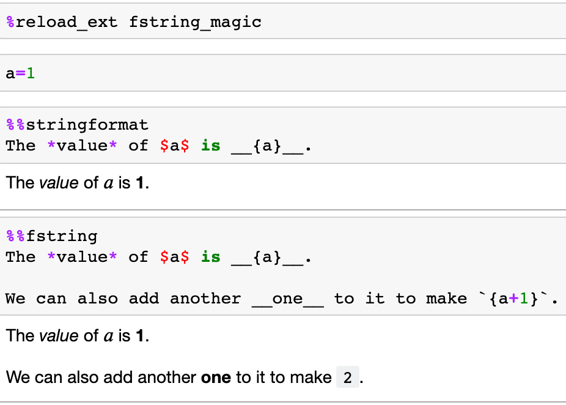

# fstring-magic
Simple magic to interpret code cell content as a simple formatted string or as an f-string.

Installation:

`pip install git+https://github.com/innovationOUtside/fstring-magic.git`

To load the magic: `load_ext fstring_magic`

Two *%%block* magics are currently supported:

`%%stringformat`: pass the content of the code cell to a string formatter running in the local scope (essentially `cell.format(**shell.user_ns) )`)

`%%fstring`: treat the content of the code cell as an f-string (note this uses and `eval()` so treat with caution... Essentially runs `eval("f'''" + cell + "'''", local_ns)` 

This might be useful where a notebook or markdown file is being used to author a Jupyter Book generated HTML site and inline code outputs are required in text without having to use [`glue`](https://jupyterbook.org/content/executable/output-insert.html). The code cell input should also be removed using a `remove-input` tag so that only the output formatted markdown is displayed. 
